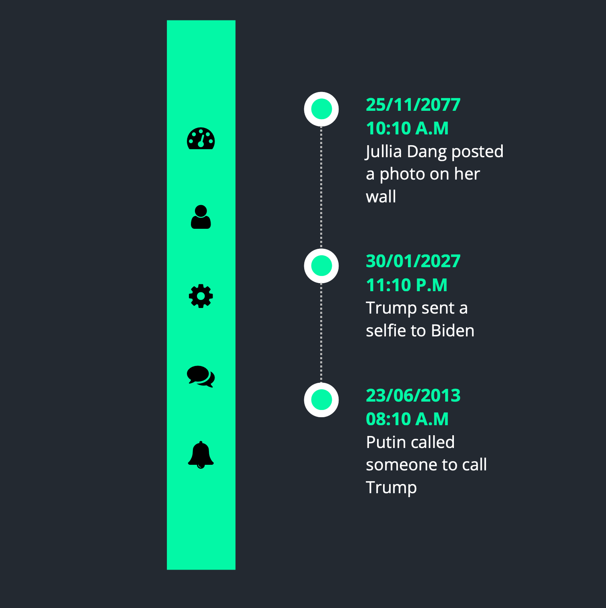

# Just my practices in my fullstack job 

## Ex1 result: A simple 404 page

## Ex2 result: Social media buttons with hover effects and links

## Ex3 result: 3D card

## Ex4: simple social media share button

## Ex5: Multilevel dropdown menu

## Ex6: Another Dropdown menu

## Ex7: Toggle buttons

## Ex8: Login menu

## Ex9: Toggle buttons

## Ex10: report timeline

## Ex11: Countdown to new year

## Ex12: Canvas

